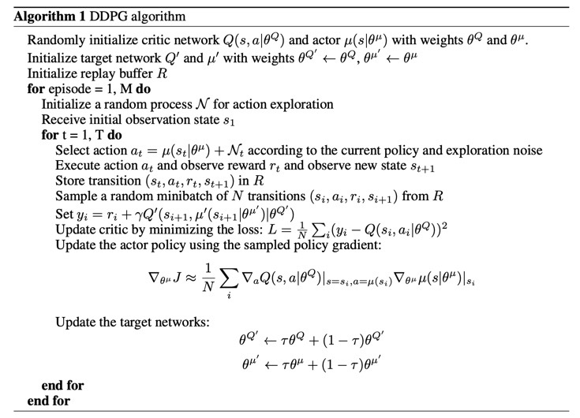
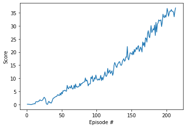

# Project Report - Continuous Control

**Introduction**

This project solves a 20-agent environment Reacher simulated in Unity to achieve a specified goal. The model implemented is the DDPG algorithm. DDPG is an actor-critic model but essentially approximates the DQN algorithm for environments with continuous action space, such as the environment in this project.

**Learning Algorithm**

DDPG adapts the Deep Q-Learning to the continuous action domain. It is an actor-critic, model-free algorithm based on the deterministic policy gradient that can operate over continuous action spaces. 

The model used an actor-critic approach based on the DPG algorithm.
The DPG algorithm maintains an actor function and a critic function. Specifically: 

* The actor function μ(s|θμ) specifies the current policy by deterministically mapping states to a specific action. 
* The critic function Q(s, a) is learned using the Bellman equation as in Q-learning. 

**Model Architecture**

Each of the actor and critic function utilises two neural networks: a regular network and a target network. The regular network is used for training whilst the target network is for testing. The DDPQ implemented here also includes two important features:

1. Replay buffer, similar to DQN, is used to randomise agents' experiences and break the correlations between states;
2. Soft updates, is designed to gradually but regularly update the weights of the target networks by mixing in a tiny portion of the regular networks. This technique is used for better model convergence. 

Below is the pseudo code used in the original DDPG paper: 

Each neural network consists of 3 fully-connected layers. The first two layers used the ReLU activation function. The output layer for the actor used a Tanh activation. This is because every entry in the action vector in the Reacher environment should be a number between -1 and 1. It should be noted that the critic network does not make use of an activation function in the output layer.

**Chosen hyper parameters**

Replay buffer size: int(1e6)  
Batch_size: 1024        
Discount factor Gamma: 0.99            
Soft update parameter Tau: 1e-3        
Learning rate for the actor: 1e-4  
Learning rate for the critic: 1e-3
Weight decay rate: 0

**Results**

The DDPG model solved the problem in 213 episodes scoring an average of 30.29 in 100 episodes. Following figure shows the average score plot.

**Plot of Rewards**

**Ideas for Future Work** 

Other algorithms may potentially be helpful for the 20 agent version including PPO, A3C and D4PG which use multiple (non-interacting, parallel) copies of the same agent to distribute the task of gathering experience. 

It would also be interesting to see what result could we obtain using  meta-agent learning method in a competitive environment.